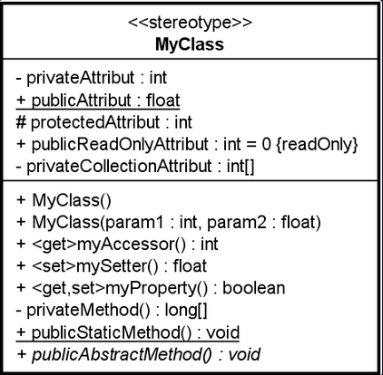

# Introduction à la POO

Sources:&#x20;

* [Mozilla foundation - Programmation orientée objet](https://developer.mozilla.org/fr/docs/Learn/JavaScript/Objects/Object-oriented_programming)
* [Geeks for Geeks - python oops concepts](https://www.geeksforgeeks.org/python-oops-concepts/)

## Introduction

La programmation orientée objet est un paradigme de programmation fondamental pour de nombreux langages de programmation, dont Java et C++. Dans cet article, nous fournirons un aperçu des notions de base de la programmation orientée objet et décrirons trois concepts:

* Les classes et instances
* L'héritage (contenu à venir)
* L'encapsulation (contenu à venir)

## Les classes et instances

En programmation orientée objet (POO), les **classes** servent de modèle pour créer des objets. Une classes est un type dont nous avons besoin pour notre projet.

Les classes définissent les propriétés (attributs) et les comportements (méthodes) partagés par tous les objets de ce type. Une **instance** est un objet concret créé à partir d'une classe. Chaque instance peut avoir des données propres, tout en partageant la structure définie par la classe. Par exemple, une classe `Vehicule` peut définir des attributs comme `marque` ou `modele` et des méthodes comme `demarrer`. Une autre classe, comme `Conducteur`, peut interagir avec une instance de `Vehicule`, réalisant ainsi une collaboration entre objets.

Voici un extrait d'un diagramme de classe exprimant "presque" toutes les variantes les plus utiles en pratique.

<figure><figcaption></figcaption></figure>

Voici un exemple en Python sur un cas moins "abstrait:


Où sont les attributs et où sont les méthodes ?



```python
class Vehicle:
    def __init__(self, brand, model):
        self.brand = brand
        self.model = model
        self.is_running = False

    def start(self):
        if not self.is_running:
            self.is_running = True

class Driver:
    def __init__(self, name):
        self.name = name

    def take_vehicle(self, vehicle):
        if vehicle.is_running:
            raise Exception("The vehicle is not available for a ride.")
        vehicle.start()

# Example usage:
car = Vehicle("Toyota", "Corolla")
driver = Driver("Alice")

# The driver takes the vehicle and starts it
driver.take_vehicle(car)

# Testing the behavior when trying to take the same vehicle again
try:
    driver.take_vehicle(car)
except Exception as e:
    print(e)  # Output: "The vehicle is not available for a ride."
```


## Bonus

Certaines nouveaux langages profitent des retours d'expériences des années dernières concernant cette pratique. Les "anciens" langages quant-à-eux, tentent de se moderniser en intégrant ces principes.

Jetez un coup d'oeil à cette page et identifiez en quelle année Php a débuté l'intégration "massive" des principes de l'orientée objet.


